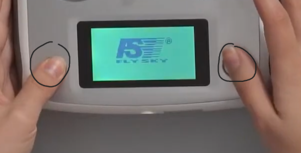
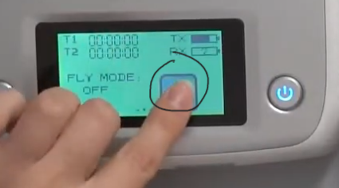
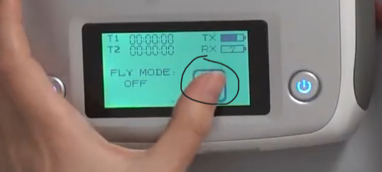
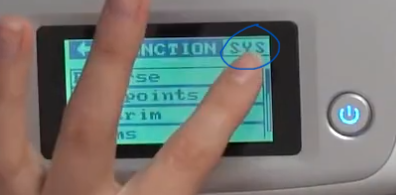
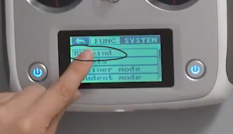
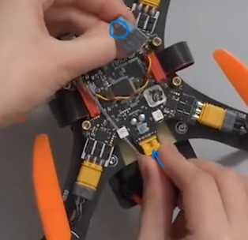
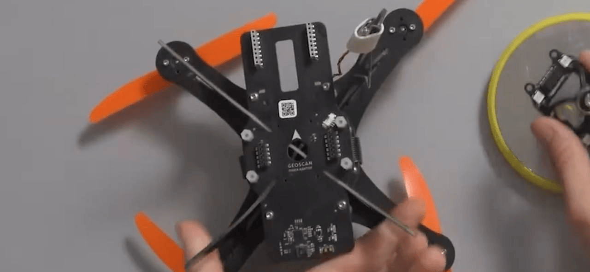
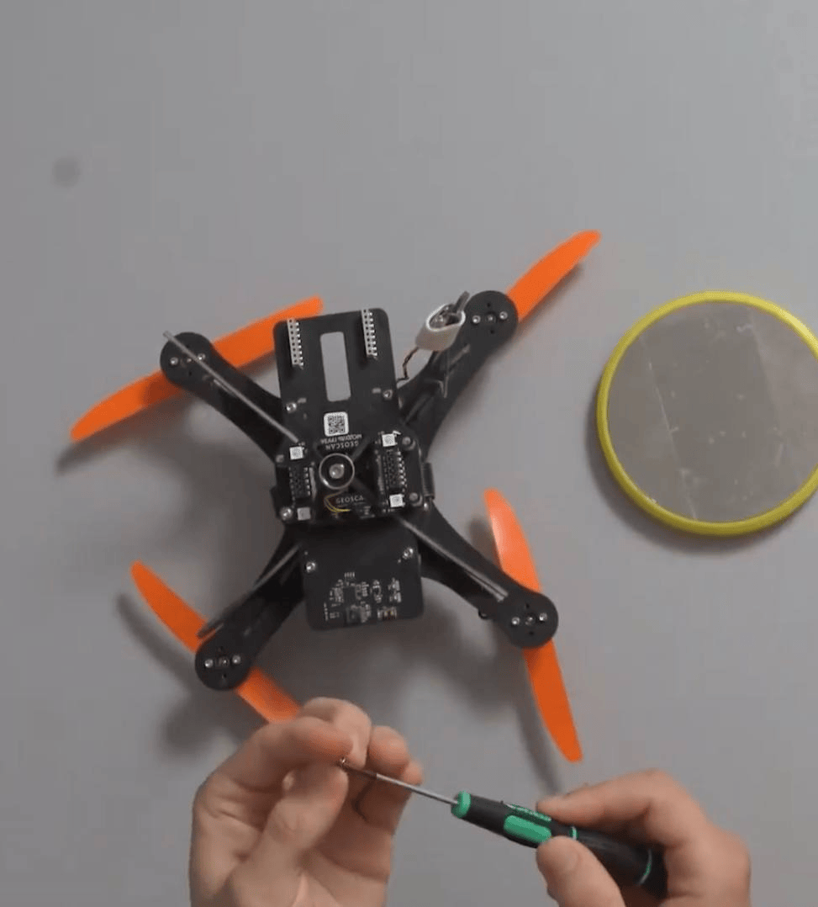

# Инструкция к экзамену

## Задание 1

A. Проверь дрон на повреждения и на нехватку деталей.

   

B. Биндим аппаратуру к дрону.

1. Для начала вам необходимо подключить провод связывающий коптер и приемник к разъему на основной плате, он называется ppm.(ФОТО НЕТ)
2. далее берем приемник и подключаем в разъем vss (НО ЭТО В ТОМ СЛУЧАЕ ЕСЛИ ЭТО ВСЕ НЕ ПОДКЛЮЧЕНО!)
 
3. далее зажимаем две кнопки на пульте для включения 
4. далее зажимаем кнопку для того чтобы войти в настройки 
5. далее нажимаем настройки 
6. далее нажимаем sys 
7. нажимаем во вкладку rx bind 
8. зажимаем кнопку на приемнике и вставляем аккум, после чего выходим из rx bind
9. 

C. Заливаем прошивку на дрон и подключаем магнит.

1. Далее подключаем магнит к дрону  
2. после чег

D. Заливаем прошивку на камеру.

Полная инструкция по камере.

