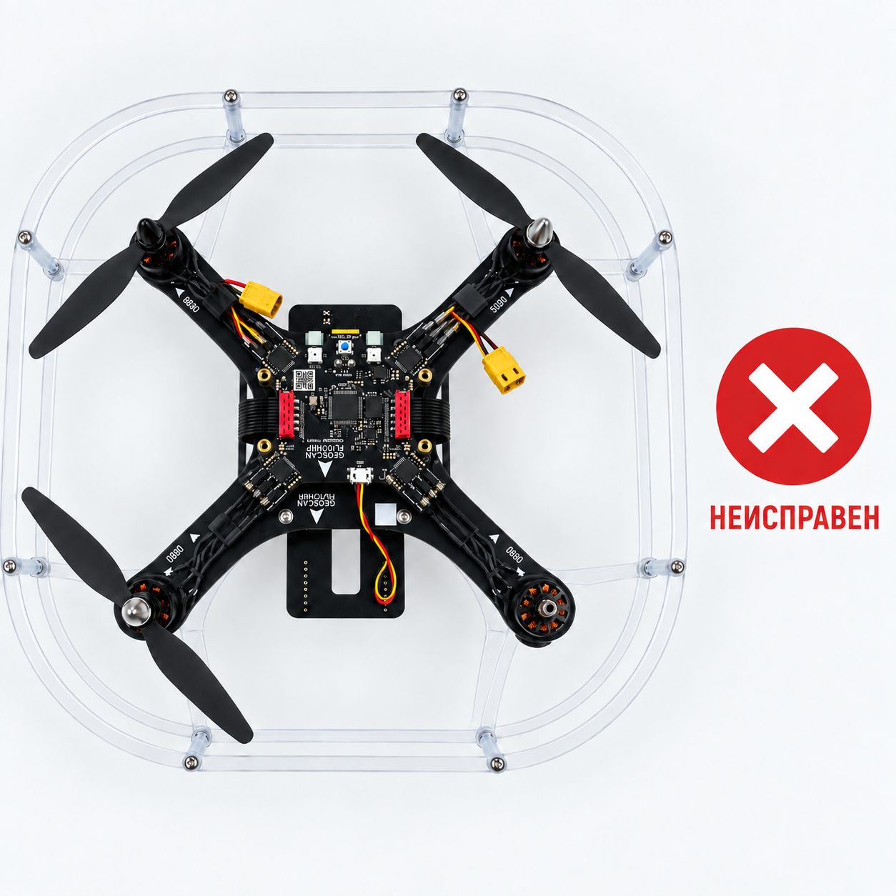
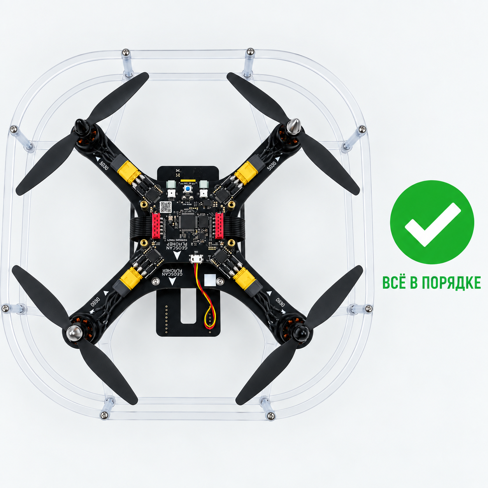
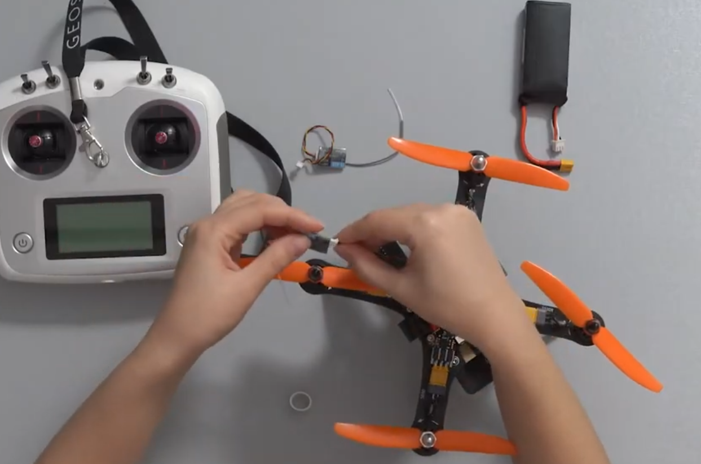

# Инструкция к экзамену

## Задание 1

1. Проверь дрон на повреждения и на нехватку деталей.

   

2. Биндим аппаратуру к дрону.

1. Для начала вам необходимо подключить провод связывающий коптер и приемник к разъему на основной плате, он называется ppm.(ФОТО НЕТ)
2. далее берем приемник и подключаем в разъем vss (НО ЭТО В ТОМ СЛУЧАЕ ЕСЛИ ЭТО ВСЕ НЕ ПОДКЛЮЧЕНО!)
 
3. далее

3. Заливаем прошивку на дрон и магнит.

Полная инструкция по прошивке.

4. Заливаем прошивку на камеру.

Полная инструкция по камере.

